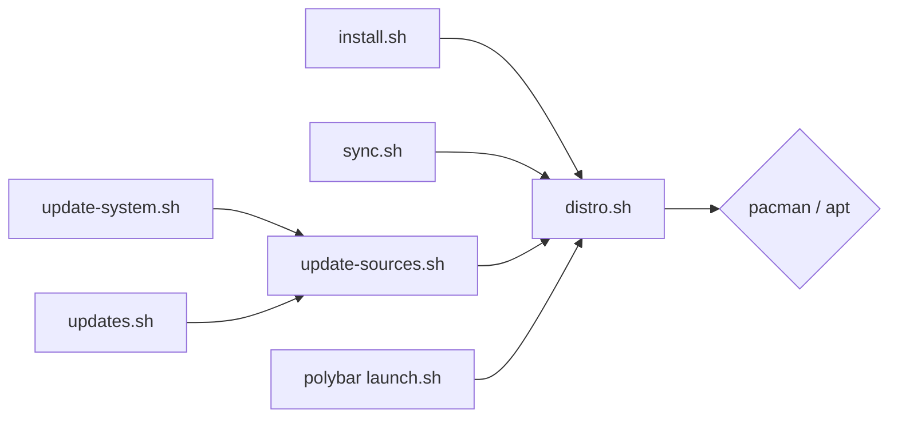
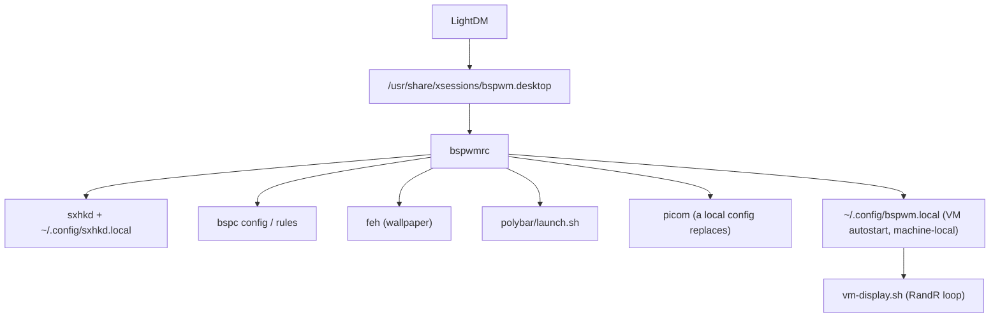
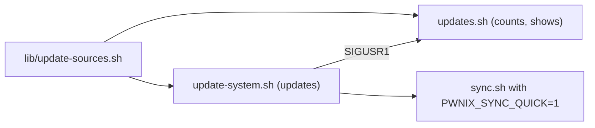

# Architecture

How this repository is put together, for anyone changing it. The [README](README.md) covers
using the environment; this file covers building on it.

## Table of Contents

- [Scope](#scope)
- [Repository Layout](#repository-layout)
- [The Distribution Seam](#the-distribution-seam)
- [Install Path](#install-path)
- [Deployment Model: GNU Stow](#deployment-model-gnu-stow)
- [Session Runtime](#session-runtime)
- [Machine-Local Override Layer](#machine-local-override-layer)
- [Polybar as a Process Tree](#polybar-as-a-process-tree)
- [Update Path](#update-path)
- [Shell Layer](#shell-layer)
- [Invariants](#invariants)
- [Extension Points](#extension-points)

---

## Scope

pwnix is not an application. It is two things: a set of shell scripts that bring a machine
from a bare Arch or Kali install to a working bspwm desktop, and a tree of configuration files
that becomes that desktop's `~`. There is no build, no runtime process of our own, and no state
beyond a handful of files under `$HOME`.

The same repository installs on **Arch Linux** and on **Debian/Kali**. Every difference between
them is resolved in one file (`distro.sh`); nothing else in the tree branches on the
distribution.

What it deliberately does **not** own:

| Not owned | Why | Where it lives |
|---|---|---|
| Security tooling | The distribution's job — BlackArch on Arch, the `kali-tools-*` metapackages on Kali | README |
| Neovim plugins | LazyVim manages itself; the starter is installed once and never touched again | `~/.config/nvim`, upstream |
| Python venvs, oh-my-zsh, hand-cloned tools | Guessing at somebody's hand-built tooling is how an updater breaks what it was meant to maintain | README, one command each |

`install.sh` is the only installer. Everything else updates what is already there.

## Repository Layout

| Path | Role |
|---|---|
| `install.sh` | One-shot bootstrap: packages, services, branding, dotfiles, root environment. Interactive. |
| `sync.sh` | Re-deploy the symlinks without installing anything. Safe to re-run; used after a `git pull` or to repair. |
| `dotfiles/<package>/` | One GNU Stow package per application. The tree below it mirrors `$HOME` exactly. |
| `dotfiles/polybar/.config/polybar/theme/scripts/lib/` | The shared shell libraries — `distro.sh` and `update-sources.sh`. Sourced from outside polybar too. |
| `assets/fonts/` | JetBrainsMono Nerd Font, copied (not linked) to `~/.local/share/fonts`. |
| `assets/wallpapers/` | `arch.png` and `kali.png`. One of them is copied to `~/Wallpapers/wallpaper.png`, which is the only name the configs reference. |
| `.gitattributes` | `* text=auto eol=lf`. These files are sourced by `/bin/sh`; a CRLF would break them. |
| `.gitignore` | Excludes `dotfiles/files/.config/files/target`, the one tracked path written at runtime. |

The libraries live under `polybar/` for a practical reason: a polybar module can only reach
files that stow has deployed, so the library has to be inside a stow package. `install.sh`,
`sync.sh` and `update-system.sh` all reach into that path rather than keeping a copy.

## The Distribution Seam

`dotfiles/polybar/.config/polybar/theme/scripts/lib/distro.sh` is the only file that knows
Arch from Debian. Every other script asks it and decides nothing itself. It sets no state and
runs nothing when sourced.



**Identity.** `distro_id` answers `arch`, `debian` or `unknown`, reading `ID` first and then
`ID_LIKE`, so derivatives land on the right side without being listed one by one.
`distro_variant` gives the exact distribution — `distro_id` folds Kali into `debian` because
that is what matters for packaging, but branding has to tell them apart.

**Branding.** `brand_name`, `brand_glyph`, `brand_color`, `brand_wallpaper` and
`install_wallpaper` decide the logo, the accent colour and the wallpaper. Read by the polybar
launcher, the updater and the installer, so a machine never wears another distribution's badge.

**Packages.** Callers pass *logical* names (`build-tools`, `firefox`, `python-pip`) and
`pkg_name` translates. Two return conventions matter:

- An empty answer means *this distribution has no such package*. That is a normal answer, not
  an error: `wmname` does not exist on Debian, `checkupdates` has no equivalent. Callers skip it.
- Anything not in the table is assumed to be spelled the same on both, which covers most of
  the list.

`pkg_install` installs only what is missing, collects unknown names in `PKG_UNAVAILABLE` and
failures in `PKG_FAILED_LAST`, and — because both managers are transactional — retries the
batch one package at a time when it fails, so one bad name cannot take twenty good ones down
with it.

**Counting convention.** A counting function prints a number and returns 0, or prints nothing
and returns 1 when it *cannot tell*. Offline is not the same as up to date, and the bar shows
them differently (`?` versus `None`).

**Services and state.** `vm_units` names the guest-tool units as this distribution spells them;
`service_enable` skips units that are absent, static or already enabled rather than printing
failures at somebody mid-install. `reboot_required` / `reboot_reason` answer from the running
kernel on Arch and from `/var/run/reboot-required` on Debian.

**Testing hook.** `PWNIX_OS_RELEASE` overrides which file describes the system, so the whole
matrix can be exercised from one machine instead of only the distribution it runs on.

## Install Path

`install.sh` runs once, on a fresh machine, and is interactive by design. The order is not
arbitrary:

1. **Pre-flight** — refuses to run as root, takes the sudo password once and keeps the
   timestamp alive in a background loop (killed by an `EXIT` trap), and tees everything to
   `~/install-log.log`.
2. **Packages** — grouped by purpose, all through `pkg_install`, so anything already present
   (most of it, on Kali) is left exactly as it is. Audio follows what the machine already has:
   PipeWire components if PipeWire is installed, PulseAudio otherwise.
3. **Per-distribution extras** — on Arch, bootstrap `yay` from source and pull
   `python-pywal` and `i3lock-fancy-git`; on Debian, `i3lock-fancy` from the repositories and
   pywal through `pipx`, which keeps it out of the system Python that Kali is particular about.
4. **Services** — NetworkManager under either of its two unit names. LightDM is enabled **only
   if no display manager is already running**: Kali boots with its own and bspwm joins it as
   another session. Switching it here is how a machine ends up with no way back to a desktop.
5. **Static resources** — fonts and wallpapers are *copied*, not linked; they never change.
6. **Oh My Zsh and powerlevel10k, before stow** — Oh My Zsh writes its own `.zshrc`, so it has
   to run first for ours to replace it.
7. **Stow** — see below.
8. **Verification** — four links a working session cannot start without.
9. **LazyVim** — cloned only if `~/.config/nvim` is absent, then `Lazy! sync` twice. The second
   pass is not superstition: on the first sync mason is still installing `tree-sitter-cli` when
   LazyVim's treesitter build asks for the same thing, and the loser aborts.
10. **Local overrides, `bspwm.desktop`, root environment, BlackArch (Arch only), guest additions.**
11. **An honest ending** — if any package failed, any stow package failed, or any critical link
    is missing, it prints `INSTALLATION INCOMPLETE` and what to fix. Saying "complete" after
    failing to deploy anything is how a broken install reaches the login screen unnoticed.

## Deployment Model: GNU Stow

Eight stow packages, deployed with `$HOME` as the target and `dotfiles/` as the stow directory:

```
zsh  bspwm  sxhkd  polybar  picom  kitty  rofi  files
```


Three details are load-bearing:

- **Conflicts are removed first.** Stow refuses to overwrite a real file, and Oh My Zsh has
  just written one (`~/.zshrc`). The pre-pass deletes exactly the paths these packages own.
- **One package at a time.** Stow is all-or-nothing per invocation: passing all eight meant a
  single package it disliked aborted the lot and left nothing linked at all. Failures are
  collected in `STOW_FAILED` and reported.
- **Deployment is then verified.** Having run stow and having the dotfiles in place are
  different claims. `~/.config/bspwm/bspwmrc`, `~/.config/polybar/launch.sh`,
  `~/.config/sxhkd/sxhkdrc` and `~/.zshrc` are checked to exist.

Two files are left behind on purpose:

| File | Purpose |
|---|---|
| `~/.config/.pwnix-repo-path` | Where this clone is. Read by the updater and by the polybar module — nothing else can find the repository from a running session. |
| `~/.config/files/target` | The current engagement target, shared between the shell, polybar and root (which reaches it through a symlink at `/root/.config/files/target`). |

**The consequence to keep in mind:** every deployed config *is* the repository file. Editing
`~/.zshrc` is editing this repository, and `git status` will say so. That is intended — it is
also why the local override layer exists for anything you do not want committed, and why the
updater treats only *behind* as an update.

Root gets the shell configs by direct symlink into the repository (`/root/.zshrc`,
`/root/.p10k.zsh`), so both users read one source. Oh My Zsh is not in the repository, so it is
copied instead.

## Session Runtime



`bspwmrc` is the whole session start-up. Points worth knowing before editing it:

- **sxhkd takes extra config files as positional arguments, never as a repeated `-c`.** That
  option assigns rather than accumulates, so a second `-c` silently drops every binding shipped
  in `sxhkdrc`.
- **picom's local config replaces the shipped one outright**, unlike every other override.
  picom's format rejects duplicate settings, so an include could only ever add keys.
- **The volume reset is stamped.** `~/.cache/pwnix-volume-set` makes it happen once, for the
  case where no audio daemon was running when `install.sh` tried. Forcing it every login would
  fight whatever level you settle on.
- **`~/.config/bspwm.local` is sourced last**, and lives outside the stow tree so a dotfiles
  update cannot discard it. Both `install.sh` and `sync.sh` carry a one-off migration that
  moves legacy VM autostart lines out of the tracked `bspwmrc` and into it.

`scripts/vm-display.sh` handles a cold-boot race under QEMU/SPICE: X comes up at the
hypervisor's default mode, spice-vdagent later negotiates the real size and marks it
*preferred*, but nothing reapplies it — and the wallpaper and the bar have already been drawn
at the wrong size. The script listens on real RandR events through `xev` (no polling, no
sleeps), and when preferred differs from active it runs `xrandr --auto` and redraws the
screen-sized components. It keeps a single instance across `bspc wm -r`, and its
`refresh_visuals` has to stay in step with the visual autostart block in `bspwmrc`.

## Machine-Local Override Layer

Every shipped config has a companion file outside the repository. They are created empty by
`install.sh` and `sync.sh` so a config that hard-fails on a missing include cannot break, and
so they are discoverable.

| Shipped | Local override | Semantics |
|---|---|---|
| `~/.zshrc` | `~/.zshrc.local` | Sourced last — extends |
| `~/.config/bspwm/bspwmrc` | `~/.config/bspwm.local` | Sourced last — extends |
| `~/.config/sxhkd/sxhkdrc` | `~/.config/sxhkd.local` | Extra sxhkd config file — extends |
| `~/.config/kitty/kitty.conf` | `~/.config/kitty.local.conf` | `include` at the end — extends |
| `~/.config/polybar/theme/config.ini` | `~/.config/polybar.local.ini` | Last `include-file` — extends |
| `~/.config/rofi/launcher.rasi` | `~/.config/rofi.local.rasi` | `?import` at the end — extends |
| `~/.config/picom/picom.conf` | `~/.config/picom.local.conf` | **Replaces** — and is therefore *not* created empty |

Two mechanics matter. Rofi uses `?import`, not `@import`: a missing file must not abort parsing
and leave you menuless. And picom is the exception in both directions — an empty local file
would leave the machine with no compositor settings at all, which is why nothing creates one.

## Polybar as a Process Tree

`launch.sh` sources `distro.sh`, exports `PWNIX_OS_GLYPH` and `PWNIX_OS_COLOR`, kills any
running bar, waits for it to actually exit, and starts `polybar -q main`. `modules.ini` reads
those two through `${env:...}` with an Arch fallback, which is how the bar wears the right
badge without any module knowing what a distribution is.

`config.ini` includes `colors.ini`, `glyphs.ini`, `modules.ini` and — last, so it wins —
`~/.config/polybar.local.ini`.

Modules come in two kinds. `internal/*` (bspwm, date, pulseaudio, fs, cpu) are polybar's own.
`custom/script` modules are our shell scripts: `updates.sh` is a persistent loop that prints a
line and sleeps, the rest are one-shot scripts polybar re-runs on an interval, with
`click-left` copying the value to the clipboard.

Two rules bind anything running in the bar:

- **A module must never ask for anything.** No password, no askpass, no prompt — there is no
  terminal to answer in. `pwnix_fetch` wraps `git fetch` in a timeout plus
  `GIT_TERMINAL_PROMPT=0`, `GIT_ASKPASS`, `SSH_ASKPASS_REQUIRE=never` and
  `ssh -o BatchMode=yes` for exactly this reason; `pkg_count_updates` counts against the
  existing apt lists rather than refreshing them, because refreshing needs root.
- **`SIGUSR1` forces an immediate refresh.** `updates.sh` traps it and `update-system.sh` sends
  it on completion, so the number in the bar is correct the moment an update ends rather than
  up to thirty minutes later.

## Update Path



`lib/update-sources.sh` defines *what counts as a source*, and is read by both the counter and
the updater. That is the entire reason it exists: written twice, the two would drift and the
number in the bar would stop meaning anything.

There are two sources and deliberately only two: the package manager (pacman with BlackArch and
the AUR, or apt) and the pwnix repository itself. The repository is shown as a glyph rather
than added to the number — new configuration is a different thing from packages to install.

**Only *behind* counts as an update.** Commits of your own that the remote does not have are
not something to install, and reading the comparison as "local != remote" is what kept the
glyph permanently lit on any machine where a config had been committed — which stow actively
invites. `pwnix_upstream` resolves the configured upstream, or `origin/<branch>`, and returns
nothing at all on a detached HEAD rather than silently comparing against the default branch.

`update-system.sh` updates what is there and installs nothing that is not. It takes sudo once
and keeps it alive (long AUR builds outlive the default five-minute timestamp), updates
keyrings first on Arch (or every signature check after it fails), upgrades packages, then
re-runs `sync.sh` with `PWNIX_SYNC_QUICK=1` — which re-stows everything but skips the git pull
and the VM prompt, because the updater handles git itself. It ends with a report of what was
updated, what failed, and the manual command for each failure.

`sync.sh` is that same deployment step standing alone: no packages, no services. Run bare it
also pulls, and when local and remote have diverged it asks — merge (stashing first), reset, or
skip — rather than choosing for you. Given a package name it re-stows just that one and does
nothing else.

## Shell Layer

`.zshrc` is a single tracked file shared by the user and root. Its ordering constraints:

- The **powerlevel10k instant prompt block stays at the very top**; anything that needs input
  must come before it.
- Plugin paths are probed in both locations — Arch puts them under `/usr/share/zsh/plugins/`,
  Debian directly under `/usr/share/` — which is what makes one file work on both.
- Binary-name fallbacks follow the same principle: Debian ships bat as `batcat` and fd as
  `fdfind`, so looking only for `bat` left Kali without the alias.
- `~/.zshrc.local` is sourced on the **last line**, so anything in it wins.

Above that sit the helper functions (`workspace-init`, `target-set`, `nmap-extract`,
`revshell`, `system-update`…), each with a short alias and documented in the README.
`target-set` writes `~/.config/files/target`, the one piece of shared state between the shell
and the bar: the shell writes it, `set_target.sh` reads it into the bar, and root sees the same
file through a symlink.

## Invariants

These are enforced by the code as it stands. Breaking one is a regression even when nothing
errors:

1. **Every script is idempotent.** `install.sh` and `sync.sh` are re-runnable at any point;
   that is the documented repair path.
2. **Never touch what is already installed.** neovim, LazyVim, a running display manager, a
   user's `~/.config/nvim` — present means left alone. On Kali most of the package list is
   already there.
3. **"Cannot tell" is not "zero".** Offline shows `?`, never `None`.
4. **Fail loudly, at the end, with the fix.** Collect failures, keep going, and report each one
   with the command that repairs it.
5. **Nothing runs as root**, and nothing in the bar can ever prompt.
6. **Runtime never writes to a tracked file.** State goes to `~/.config`, `~/.cache`, or the one
   gitignored `target` path.
7. **A change works on Arch and on Kali, or it is not finished.** If it needs to know which, it
   asks `distro.sh`.

## Extension Points

**A new stow package.** Create `dotfiles/<name>/` with the tree below it mirroring `$HOME`, then
add the name to `STOW_PACKAGES` in `install.sh` **and** to `ALL_PACKAGES` in `sync.sh` — both
lists, or a fresh install and a sync will disagree. If it is a config a user will want to
extend, give it a local override file in `ensure_local_overrides` (in both scripts) and wire the
include into the shipped config.

**A new package name.** Add the logical name to `pkg_name` in `distro.sh`, in both branches.
Return an empty string where the distribution has no equivalent; do not work around it at the
call site. Then use the logical name in the `PKG_GROUPS` list.

**A new polybar module.** Script into `theme/scripts/`, section into `modules.ini`, and the name
into the `modules-left` / `modules-center` / `modules-right` line of `config.ini`. If it needs
to know the distribution, source `lib/distro.sh`; if it counts something, follow the counting
convention (a number and 0, or nothing and 1).

**A new distribution.** Add its `ID` / `ID_LIKE` to `distro_id`, and a branding case if it needs
its own glyph and wallpaper. If it is a derivative of Arch or Debian that is usually all — the
package tables are keyed on the family, not the variant.

**A new keybinding.** `dotfiles/sxhkd/.config/sxhkd/sxhkdrc`, and the README's shortcut table in
the same change. Bind to a script under `~/.config/bspwm/scripts/` rather than to a binary when
the binary differs between distributions — that is what `browser.sh` exists for, after
`super + f` turned out to be a dead key on whichever distribution the author was not using.
