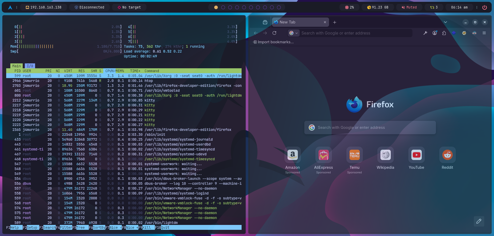

# pwnix

> Automates the setup of a professional hacking environment on **Arch Linux** and **Kali Linux**, built around the tiling window manager [bspwm](https://github.com/baskerville/bspwm).

The same repository installs on either one: it detects the distribution and adapts the package
names, the security tooling, the desktop session it registers, and the logo and wallpaper it
dresses the desktop in.

> **Every command that depends on your distribution is inside an Arch Linux or Kali Linux
> drop-down.** Open yours and ignore the other — you will never need to translate a command by
> hand. Anything not inside one works the same on both.

Changing the repository rather than using it? [ARCHITECTURE.md](ARCHITECTURE.md) explains how
it is put together.

## Important Notes

ISO downloads: [Arch Linux](https://archlinux.org/download/) · [Kali Linux](https://www.kali.org/get-kali/)

## Table of Contents

- [Installation](#installation)
- [Virtual Machine Guest Additions (Optional)](#virtual-machine-guest-additions-optional)
- [Keeping the System Updated](#keeping-the-system-updated)
- [Overview of the Environment](#overview-of-the-environment)
- [Keyboard Shortcuts](#keyboard-shortcuts)
- [Environment Helper Functions](#environment-helper-functions)
- [Software](#software)
- [Recommended Security Tools](#recommended-security-tools)
- [Python Hacking Libraries](#python-hacking-libraries)
- [AI-Powered Security (OpenCode + MCP)](#ai-powered-security-opencode--mcp)
- [Troubleshooting](#troubleshooting)

---

## Installation

Pick your distribution below. Each path is self-contained — follow one and ignore the other.
The installer detects which system it is on and adapts: package names, the security tooling,
the desktop it registers itself with, and the logo and wallpaper it dresses the desktop in.

<details>
<summary><b>&nbsp;Arch Linux</b></summary>

### Arch Linux Base Installation

#### 1. Boot from Arch ISO

After booting from the Arch Linux ISO, run the automated installer:

```shell
archinstall
```

#### 2. Configure Installation

Follow these settings in the `archinstall` menu:

##### Disk Configuration

- **Partitioning**: Use a best-effort default partition layout
- **Filesystem**: ext4
- **DO NOT** create a separate `/home` partition

##### Network Configuration

- Select: **NetworkManager**

##### The rest is up to you

- Configure timezone, locale, user account, etc. as desired

#### 3. Complete Base Installation

- Review your configuration
- Confirm and proceed with installation
- Wait for installation to complete
- Reboot when prompted

---

### BSPWM Environment Installation

After rebooting into your fresh Arch installation:

#### 1. Update System and Install Git

```shell
sudo pacman -Syu --noconfirm git
```

#### 2. Clone Repository

Clone the repo wherever you want. This directory **must stay in place** — all configuration files are symlinked from it using [GNU Stow](https://www.gnu.org/software/stow/).

```shell
git clone https://github.com/j4murrio/pwnix.git
cd pwnix
```

#### 3. Grant Execution Permissions

```shell
chmod +x install.sh
```

#### 4. Execute Installation Script

```shell
./install.sh
```

> The script will prompt you to install **VM Guest Additions** (VMware or QEMU/KVM) before rebooting. You can skip this step if you are not running inside a virtual machine.
>
> The full installation process is logged to `~/install-log.log`. You can review it anytime and delete it when no longer needed.

### Dotfiles Management

All configuration files live inside `dotfiles/` and are deployed as symlinks via GNU Stow. Editing `~/.config/polybar/theme/config.ini` (for example) actually edits the file inside the repo — you can `git commit` and `git push` directly.

```shell
# Re-deploy all symlinks (after cloning on a new machine, or to repair)
bash sync.sh

# Re-deploy a single package
bash sync.sh polybar
```

> **Do not delete or move the cloned repo.** If you need to relocate it, re-run `bash sync.sh` from the new location to update all symlinks.

> **Your own tweaks do not belong in these files.** Because they are symlinks into the repo, an update has to reconcile them. Put machine-specific settings in the `.local` files instead — see [Keeping your own configuration](#keeping-your-own-configuration).

#### 5. Reboot System

After the script finishes, reboot your system:

```shell
sudo reboot
```

#### 6. Review Installation Log

After rebooting, review the installation log to check for any errors or warnings:

```shell
cat ~/install-log.log
```

Once reviewed, you can safely delete it:

```shell
rm ~/install-log.log
```

</details>

<details>
<summary><b>&nbsp;Kali Linux</b></summary>

### Before you start

This assumes a working Kali install — the standard image is fine, and so is a minimal one.
Nothing here replaces your desktop: **bspwm is added as an extra session**, XFCE stays exactly
where it is, and you choose between them at the login screen. If bspwm ever misbehaves, log
out and pick XFCE again.

Two differences from the Arch path, both handled for you:

- **Nothing already installed is touched.** Kali ships with a lot of this, and the installer
  checks each package first and skips what is present.
- **No security tools are installed.** They _are_ Kali. If you want more, the `kali-tools-*`
  metapackages are the way — see [kali-meta](https://www.kali.org/tools/kali-meta/).

#### 1. Update System and Install Git

```shell
sudo apt update && sudo apt install -y git
```

#### 2. Clone Repository

Clone it wherever you like. This directory **must stay in place** — every config file is
symlinked from it with [GNU Stow](https://www.gnu.org/software/stow/).

```shell
git clone https://github.com/j4murrio/pwnix.git
cd pwnix
```

#### 3. Grant Execution Permissions

```shell
chmod +x install.sh
```

#### 4. Execute Installation Script

```shell
./install.sh
```

> Anything the Debian repositories do not carry is listed at the end of the run and skipped,
> never treated as a fatal error. `wmname` is the known one: it has no Debian package, and
> without it some Java applications draw incorrectly. Everything else works.
>
> The full run is logged to `~/install-log.log`.

> **About prompts.** Ours are `[Y/n]` and Enter means yes, same as on Arch. Debian has one that
> looks similar and is not ours: when a package ships a new version of a config file you have
> edited, dpkg asks `(Y/I/N/O/D/Z) [default=N]` — and there Enter means _keep yours_. `sysup`
> passes `--force-confdef --force-confold` so that prompt never appears and your files are kept.

#### 5. Log out and pick bspwm

Log out rather than reboot. At the login screen there is a session selector — usually a gear
or a menu near the password field. Choose **bspwm** and log back in.

```shell
# If you would rather restart anyway
sudo reboot
```

#### 6. Review Installation Log

```shell
cat ~/install-log.log
```

</details>

---

## Virtual Machine Guest Additions (Optional)

> **Note:** The `install.sh` script already offers to install VM Guest Additions automatically during setup. The instructions below are only needed if you skipped that step or want to install them manually.

If you are running this environment inside a virtual machine, install the appropriate guest additions to enable clipboard sharing, drag & drop, automatic screen resizing, and shared folders.

### VMware

> **Note:** Make sure to enable **3D acceleration** in your VM settings (VM Settings -> Display -> Accelerate 3D graphics).

#### Install

<details>
<summary><b>&nbsp;Arch Linux</b></summary>

```bash
sudo pacman -S --noconfirm open-vm-tools gtkmm3
```

</details>

<details>
<summary><b>&nbsp;Kali Linux</b></summary>

```bash
sudo apt install -y open-vm-tools open-vm-tools-desktop
```

</details>

#### Enable on boot and start

```bash
sudo systemctl enable --now vmtoolsd.service
sudo systemctl enable --now vmware-vmblock-fuse.service
```

#### Activate now (without reboot)

```bash
# Start clipboard sharing and drag-drop for the current session
vmware-user-suid-wrapper &
```

#### Autostart clipboard & drag-drop

Add the following line to `~/.config/bspwm.local` (sourced by `bspwmrc`, and outside the repo so a dotfiles update cannot discard it) so it starts automatically on every login:

```bash
pgrep -x vmware-user-suid-wrapper > /dev/null || vmware-user-suid-wrapper &
```

#### Verify

```bash
systemctl status vmtoolsd.service
```

And that the package is actually installed:

<details>
<summary><b>&nbsp;Arch Linux</b></summary>

```bash
pacman -Q open-vm-tools
```

</details>

<details>
<summary><b>&nbsp;Kali Linux</b></summary>

```bash
dpkg -l open-vm-tools
```

</details>

---

### QEMU / KVM (virtio + SPICE)

#### Install

<details>
<summary><b>&nbsp;Arch Linux</b></summary>

```bash
sudo pacman -S --noconfirm spice-vdagent qemu-guest-agent xorg-xev
```

</details>

<details>
<summary><b>&nbsp;Kali Linux</b></summary>

```bash
sudo apt install -y spice-vdagent qemu-guest-agent x11-utils
```

</details>

#### Enable on boot and start

```bash
sudo systemctl enable --now spice-vdagentd.service
sudo systemctl enable --now qemu-guest-agent.service
```

#### Activate now (without reboot)

```bash
# Start the clipboard and auto-resize agent for the current session
spice-vdagent &
```

#### Autostart clipboard & auto-resize

Add the following line to `~/.config/bspwm.local` (sourced by `bspwmrc`, and outside the repo so a dotfiles update cannot discard it) so it starts automatically on every login:

```bash
spice-vdagent &
```

#### Autostart resolution + visual refresh (event-driven)

X starts at QEMU's default mode (e.g. `1280x800`). A moment later `spice-vdagent`
negotiates the SPICE client size and marks the larger mode (e.g. `1920x975`) as
the output's _preferred_ one, but nothing reapplies it — so X stays at
`1280x800` and the autostarted wallpaper / polybar (drawn at that size) don't
re-draw. The desktop is mis-sized until a manual
<kbd>Super</kbd> + <kbd>Alt</kbd> + <kbd>R</kbd> restart re-runs `xrandr --auto`
**and** the visuals.

To fix this automatically, autostart the bundled helper. On every RandR change it
reapplies `xrandr --output <out> --auto` (switching X to the host-negotiated
mode) and then redraws wallpaper / polybar / picom — **no sleeps, no polling**.
It listens on real X RandR events via `xev`, because a new _preferred_ mode does
not trigger bspwm's own monitor events:

```bash
~/.config/bspwm/scripts/vm-display.sh &
```

The output name is auto-detected (`Virtual-1`, `Virtual-0`, `QXL-0`, …).

> **Note:** the helper re-runs the wallpaper / polybar / picom lines, so keep its
> `refresh_visuals` block in sync if you change the visual autostart in
> `~/.config/bspwm/bspwmrc`. Your own autostart lines go in `~/.config/bspwm.local`.

#### Verify

```bash
systemctl status spice-vdagentd.service
systemctl status qemu-guest-agent.service
xrandr
```

---

## Keeping the System Updated

One command updates everything this environment installed:

```bash
sysup
```

Or click the **Updates** module in the polybar, which opens a terminal and runs the same script. It is the `apt update && apt full-upgrade` of this setup: it asks for your password **once** and keeps the session alive for the whole run, and every confirmation follows the Arch convention — pressing Enter means yes.

| Source                            | What happens                                                                           |
| --------------------------------- | -------------------------------------------------------------------------------------- |
| System packages                   | `pacman -Syu` on Arch (keyrings first, BlackArch included), `apt dist-upgrade` on Kali |
| AUR                               | `yay -Sua` — Arch only                                                                 |
| PWNIX dotfiles                    | pulls the repo and re-runs `sync.sh`; asks before touching any local edit of yours     |
| Fonts, wallpapers, xsession entry | re-copied from the repo when they change                                               |
| Mirrorlist                        | `reflector`, Arch only, and only if the list is over a week old                        |
| Cleanup                           | orphaned packages (it asks first) and the package cache                                |

**That is the whole list, on purpose.** The package manager owns what it installed, and this
repository owns the dotfiles. Everything you installed by hand stays yours to update — an
updater that guesses at somebody's hand-built tooling is how it ends up breaking the thing it
was meant to maintain.

**It never installs anything either.** A tool that is not on the machine is skipped in silence.
`install.sh` remains the only installer.

If a restart is pending afterwards, the script says so and offers to reboot.

### What you update by hand

None of these are touched by `sysup`. Same commands on Arch and Kali unless noted:

```bash
# Oh My Zsh and its plugins/themes (powerlevel10k lives under custom/themes)
omz update            # or: git -C ~/.oh-my-zsh pull
git -C ~/.oh-my-zsh/custom/themes/powerlevel10k pull

# Neovim plugins
nvim --headless "+Lazy! sync" +qa

# The persistent python venv created by wsinit
wsvenva && pip list --outdated && pip install --upgrade <package> && deactivate

# Anything you cloned yourself
git -C ~/Tools/<tool> pull

# Language and app managers, if you use them
flatpak update
pipx upgrade-all
rustup update
cargo install-update -a
```

### What the number in the bar means

The **Updates** module counts exactly what `sysup` updates — both read the same definition, so
the number cannot drift from what the update actually does. It checks every 30 minutes, and
finishing an update signals it so it refreshes immediately rather than waiting for the next
cycle.

Two things it shows that are not numbers:

- **A git glyph** means the pwnix repo is **behind** its remote — commits waiting to be pulled. Commits of your own that the remote does not have are not an update and do not light it. That is kept separate from the number on purpose: new configuration is a different thing from packages to install.
- **`?`** means it could not find out — no network, or the mirrors are unreachable. Previously this showed `None`, which claimed there was nothing pending when nothing had been checked.

> **pipx is the one gap.** It has no command to list outdated packages ([pypa/pipx#149](https://github.com/pypa/pipx/issues/149)), and `upgrade-all --dry-run` only exists in recent versions. Where that flag is missing pipx is still updated by `sysup`, it just cannot contribute to the count.

### Distribution branding

The desktop wears the badge of whatever it is running on, decided at install time and kept in
step by updates:

|                  | Arch                         | Kali                         |
| ---------------- | ---------------------------- | ---------------------------- |
| Wallpaper        | `assets/wallpapers/arch.png` | `assets/wallpapers/kali.png` |
| Polybar launcher | Arch logo, `#0A9CF5`         | Kali logo, `#367BF0`         |
| Shell prompt     | Arch logo                    | Kali logo                    |

Both wallpapers are copied to `~/Wallpapers/`, and the one for your distribution is installed
as `~/Wallpapers/wallpaper.png`, which is the single name every config refers to. To use your
own, drop it there under that name — or add a startup line to `~/.config/bspwm.local`, which
no update ever touches.

### Keeping your own configuration

Stow deploys the dotfiles as symlinks **into the repo**, so editing `~/.zshrc` or a polybar colour is editing this repository's working tree — and an update that pulls new commits has to reconcile it with yours.

So every package has a `.local` companion that lives **outside** the repo and is loaded **last**, which means it wins. Nothing that goes in these files is ever touched by an update:

| Put this in…                  | To…                                            | Loaded by                           |
| ----------------------------- | ---------------------------------------------- | ----------------------------------- |
| `~/.zshrc.local`              | your aliases, functions, exports               | `source` at the end of `.zshrc`     |
| `~/.config/bspwm.local`       | autostart lines (VM guest additions live here) | `bspwmrc`                           |
| `~/.config/sxhkd.local`       | extra keybinds                                 | extra config file passed to `sxhkd` |
| `~/.config/polybar.local.ini` | bar colours, module tweaks                     | `include-file` in `config.ini`      |
| `~/.config/kitty.local.conf`  | font size, colours, keymaps                    | `include` in `kitty.conf`           |
| `~/.config/rofi.local.rasi`   | menu colours and fonts                         | `?import` in the three menu themes  |
| `~/.config/picom.local.conf`  | compositor settings                            | **replaces** the shipped config     |

`sync.sh` creates them empty on first run, so you only ever have to open one and type.

> **picom works differently on purpose.** Its config format rejects duplicate settings, so a second `backend = "glx"` would be a parse error rather than an override — an include there could only ever _add_ keys. Instead, if `~/.config/picom.local.conf` exists it is used **instead of** the repo's config. To customise it, copy `~/.config/picom/picom.conf` to that path and edit your copy. If you delete it, the shipped config takes over again.

Example:

```bash
# ~/.zshrc.local
alias k='kubectl'
export EDITOR=nvim

# ~/.config/sxhkd.local — a chord the repo does not ship
super + shift + b
	chromium
```

> **sxhkd adds, it does not override.** Its config files are read in order and sxhkd does not
> document which definition wins for a chord defined twice, so treat `sxhkd.local` as a place for
> _new_ bindings. To change one the repo already ships, edit `sxhkdrc` — that is a repo edit, and
> the update will ask whether to keep it.

#### If you edited a repo file anyway

Perfectly fine — it is how you contribute a change back. When `sysup` finds new commits it checks the working tree first:

- **Clean** — fast-forwards. No prompt, and no reset: nothing is at risk.
- **You have local changes** — it lists them and asks _"Keep your local changes?"_ (Enter = yes). Keeping them stashes your edits, pulls, and replays them on top. Answering no discards them and matches the remote exactly.
- **Your edit collides with an incoming one** — the update stops and says so, and your work stays safe in the stash. `git stash pop` in the repo after resolving.
- **You committed, and the remote moved too** — the histories have diverged and no fast-forward can take the update past your commits. It lists them, says to push or rebase them, and asks whether to discard them (Enter = no). Answering no skips the update and leaves your commits exactly where they are.

Committing without pulling anything new is not a state `sysup` reacts to at all: nothing is asked, and the bar does not light.

---

## Overview of the Environment




---

## Keyboard Shortcuts

> **Pattern:** Super = action | +Shift = move | +Alt = state/resize/control | +Ctrl = preselect

### Applications

| Shortcut                        | Action                  |
| ------------------------------- | ----------------------- |
| <kbd>Super</kbd> + <kbd>T</kbd> | Terminal (kitty)        |
| <kbd>Super</kbd> + <kbd>F</kbd> | Browser                 |
| <kbd>Super</kbd> + <kbd>D</kbd> | Rofi launcher (dmenu)   |
| <kbd>Super</kbd> + <kbd>E</kbd> | File manager (explorer) |

### BSPWM Control

| Shortcut                                         | Action              |
| ------------------------------------------------ | ------------------- |
| <kbd>Super</kbd> + <kbd>C</kbd>                  | Close window        |
| <kbd>Super</kbd> + <kbd>K</kbd>                  | Kill window (force) |
| <kbd>Super</kbd> + <kbd>Alt</kbd> + <kbd>Q</kbd> | Quit bspwm          |
| <kbd>Super</kbd> + <kbd>Alt</kbd> + <kbd>R</kbd> | Restart bspwm       |
| <kbd>Super</kbd> + <kbd>Escape</kbd>             | Reload sxhkd        |

### Window States

| Shortcut                                         | Action                    |
| ------------------------------------------------ | ------------------------- |
| <kbd>Super</kbd> + <kbd>Alt</kbd> + <kbd>T</kbd> | Tiled mode                |
| <kbd>Super</kbd> + <kbd>Alt</kbd> + <kbd>F</kbd> | Floating mode             |
| <kbd>Super</kbd> + <kbd>Alt</kbd> + <kbd>S</kbd> | Fullscreen (screen)       |
| <kbd>Super</kbd> + <kbd>M</kbd>                  | Toggle monocle (maximize) |

### Navigation

| Shortcut                                       | Action                   |
| ---------------------------------------------- | ------------------------ |
| <kbd>Super</kbd> + <kbd>Arrow Keys</kbd>       | Navigate between windows |
| <kbd>Super</kbd> + <kbd>N</kbd> / <kbd>B</kbd> | Next / Back window       |
| <kbd>Super</kbd> + <kbd>1-9,0</kbd>            | Switch to workspace      |
| <kbd>Super</kbd> + <kbd>[</kbd> / <kbd>]</kbd> | Previous/next workspace  |
| <kbd>Super</kbd> + <kbd>Tab</kbd>              | Last workspace           |

### Movement

| Shortcut                                                                 | Action                       |
| ------------------------------------------------------------------------ | ---------------------------- |
| <kbd>Super</kbd> + <kbd>Shift</kbd> + <kbd>Arrow Keys</kbd>              | Swap window position         |
| <kbd>Super</kbd> + <kbd>Shift</kbd> + <kbd>1-9,0</kbd>                   | Move window to workspace     |
| <kbd>Super</kbd> + <kbd>Ctrl</kbd> + <kbd>Shift</kbd> + <kbd>1-9,0</kbd> | Move to workspace and follow |
| <kbd>Super</kbd> + <kbd>R</kbd>                                          | Rotate tree                  |
| <kbd>Super</kbd> + <kbd>Shift</kbd> + <kbd>R</kbd>                       | Rotate tree (counter)        |
| <kbd>Super</kbd> + <kbd>=</kbd>                                          | Balance tree (equal splits)  |

### Resize

| Shortcut                                                                      | Action               |
| ----------------------------------------------------------------------------- | -------------------- |
| <kbd>Super</kbd> + <kbd>Alt</kbd> + <kbd>Arrow Keys</kbd>                     | Resize window        |
| <kbd>Super</kbd> + <kbd>Shift</kbd> + <kbd>Ctrl</kbd> + <kbd>Arrow Keys</kbd> | Move floating window |

### Preselect

| Shortcut                                                               | Action                              |
| ---------------------------------------------------------------------- | ----------------------------------- |
| <kbd>Super</kbd> + <kbd>Ctrl</kbd> + <kbd>Arrow Keys</kbd>             | Preselect direction for next window |
| <kbd>Super</kbd> + <kbd>Ctrl</kbd> + <kbd>1-9</kbd>                    | Preselect ratio (10%-90%)           |
| <kbd>Super</kbd> + <kbd>Ctrl</kbd> + <kbd>Space</kbd>                  | Cancel preselection                 |
| <kbd>Super</kbd> + <kbd>Ctrl</kbd> + <kbd>Alt</kbd> + <kbd>Space</kbd> | Cancel all preselections            |

### System

| Shortcut                                             | Action               |
| ---------------------------------------------------- | -------------------- |
| <kbd>Super</kbd> + <kbd>L</kbd>                      | Lock screen          |
| <kbd>Super</kbd> + <kbd>P</kbd>                      | Power Menu           |
| <kbd>Ctrl</kbd> + <kbd>Shift</kbd> + <kbd>Up</kbd>   | Increase volume      |
| <kbd>Ctrl</kbd> + <kbd>Shift</kbd> + <kbd>Down</kbd> | Decrease volume      |
| <kbd>Ctrl</kbd> + <kbd>Shift</kbd> + <kbd>M</kbd>    | Mute/Unmute          |
| <kbd>Print</kbd>                                     | Full screenshot      |
| <kbd>Ctrl</kbd> + <kbd>Print</kbd>                   | Screenshot selection |

### Kitty Shortcuts (terminal)

| Shortcut                                                     | Action                     |
| ------------------------------------------------------------ | -------------------------- |
| <kbd>Ctrl</kbd> + <kbd>Shift</kbd> + <kbd>C</kbd>            | Copy (c = copy)            |
| <kbd>Ctrl</kbd> + <kbd>Shift</kbd> + <kbd>V</kbd>            | Paste (v = paste)          |
| <kbd>Ctrl</kbd> + <kbd>Shift</kbd> + <kbd>T</kbd>            | New tab (t = tab)          |
| <kbd>Ctrl</kbd> + <kbd>Shift</kbd> + <kbd>Q</kbd>            | Close tab (q = quit)       |
| <kbd>Ctrl</kbd> + <kbd>Shift</kbd> + <kbd>Left/Right</kbd>   | Previous/next tab          |
| <kbd>Ctrl</kbd> + <kbd>Shift</kbd> + <kbd>,</kbd>            | Move tab backward          |
| <kbd>Ctrl</kbd> + <kbd>Shift</kbd> + <kbd>.</kbd>            | Move tab forward           |
| <kbd>Ctrl</kbd> + <kbd>Shift</kbd> + <kbd>W</kbd>            | New window (w = window)    |
| <kbd>Ctrl</kbd> + <kbd>Shift</kbd> + <kbd>X</kbd>            | Close window (x = close)   |
| <kbd>Alt</kbd> + <kbd>Arrow Keys</kbd>                       | Navigate splits            |
| <kbd>Ctrl</kbd> + <kbd>Shift</kbd> + <kbd>Z</kbd>            | Zoom split (z = zoom)      |
| <kbd>Ctrl</kbd> + <kbd>Shift</kbd> + <kbd>L</kbd>            | Change layout (l = layout) |
| <kbd>Ctrl</kbd> + <kbd>Shift</kbd> + <kbd>R</kbd>            | Resize mode (r = resize)   |
| <kbd>Ctrl</kbd> + <kbd>Shift</kbd> + <kbd>K/J</kbd>          | Scroll line up/down        |
| <kbd>Ctrl</kbd> + <kbd>Shift</kbd> + <kbd>Page Up/Down</kbd> | Scroll page up/down        |
| <kbd>Ctrl</kbd> + <kbd>Shift</kbd> + <kbd>Home/End</kbd>     | Scroll to top/bottom       |
| <kbd>Ctrl</kbd> + <kbd>Shift</kbd> + <kbd>F1</kbd>           | Save to buffer A           |
| <kbd>Ctrl</kbd> + <kbd>Shift</kbd> + <kbd>F2</kbd>           | Load from buffer A         |
| <kbd>Ctrl</kbd> + <kbd>Shift</kbd> + <kbd>F3</kbd>           | Save to buffer B           |
| <kbd>Ctrl</kbd> + <kbd>Shift</kbd> + <kbd>F4</kbd>           | Load from buffer B         |

---

## Environment Helper Functions

After logging in, several helper functions are available to streamline common pentesting tasks and environment management. Short aliases are provided for faster usage.

- **Workspace initialization**
  `workspace-init` (`wsinit`) - Creates the pentesting workspace structure, `~/VPN`, and a persistent Python hacking venv with all [recommended libraries](#python-hacking-libraries). Only creates items that don't already exist.

  ```
  ~/Workarea/
  ├── Engagements/              # Professional pentesting engagements
  │   └── _template/            # cp -r _template/ client-name/
  │       ├── recon/
  │       ├── scans/
  │       ├── exploitation/
  │       ├── post/
  │       ├── evidence/
  │       │   ├── screenshots/
  │       │   └── loot/
  │       └── report/
  ├── CTF/                      # CTF competitions
  │   └── _template/            # cp -r _template/ ctf-name/
  │       ├── pwn/
  │       ├── web/
  │       ├── crypto/
  │       ├── rev/
  │       ├── forensics/
  │       └── misc/
  ├── HTB/                      # Hack The Box / TryHackMe
  │   └── _template/            # cp -r _template/ machine-name/
  │       ├── recon/
  │       ├── scans/
  │       ├── exploit/
  │       ├── loot/
  │       └── screenshots/
  ├── Labs/                     # Practice labs (VulnHub, PortSwigger...)
  ├── Scripts/                  # Custom scripts
  │   ├── recon/
  │   ├── exploit/
  │   ├── post/
  │   └── utils/
  ├── Payloads/                 # Custom payloads
  │   ├── shells/
  │   ├── webshells/
  │   └── implants/
  ├── Wordlists/                # Custom wordlists
  ├── Tools/                    # Third-party tools (manual installs)
  ├── Notes/                    # Knowledge base
  ├── Reports/                  # Finished deliverables
  └── .python-hacking-venv/     # Persistent Python venv (auto-created)
  ~/VPN/                        # OpenVPN profiles (.ovpn)
  ```

- **Nmap results parsing**
  `nmap-extract <file>` (`nmapx`) - Extracts the target IP and open ports from an Nmap output file and copies the ports to the clipboard if `xclip` is available.

- **Target management**
  `target-set <IP> [NAME]` (`tgt`) - Sets the active target (IP and optional name) in the Polybar target file.
  `target-reset` (`tgtr`) - Clears the active target.

- **Enhanced file selection**
  `fzf-preview [h]` (`fzfp`) - Run `fzf` with syntax-highlighted previews and binary detection. Use `h` parameter for horizontal layout.

- **Secure file removal**
  `file-wipe <file>` (`fwipe`) - Securely overwrite and remove a file (uses `shred` if available).

- **SSH helper**
  `ssh-term <user@host>` (`ssht`) - Launch SSH with a terminal setting suitable for Kitty and other modern terminals.

- **VPN connectivity**
  `vpn-connect [profile.ovpn]` (`vconn`) - Connects to an OpenVPN profile stored in `~/VPN`. If no profile is provided, an interactive menu is shown.

- **Quick IP lookup**
  `myip [interface]` (`mip`) - Get the IPv4 address of a network interface. Defaults to `tun0`.

- **Reverse shell generator**
  `revshell [IP] [PORT]` (`revsh`) - Print ready-to-paste reverse shells (bash, python3, nc, php). Defaults to tun0 IP and port 4444.

- **Quick HTTP server**
  `serve [PORT]` (`srv`) - Start a Python HTTP server in the current directory. Auto-detects your VPN/ethernet IP. Defaults to port 8080.

- **Encode / decode**
  `b64e <string>` / `b64d <string>` - Base64 encode/decode.
  `urle <string>` / `urld <string>` - URL encode/decode.

- **Quick listener**
  `listen [PORT]` (`lsn`) - Start `rlwrap nc -lvnp` on the given port. Defaults to 4444.

- **Payload generator**
  `genpayload [LHOST] [LPORT] [exe|elf|php|jsp|war]` (`gpl`) - msfvenom wrapper. Defaults to tun0 IP, port 4444, elf format.

- **Wordlist search**
  `wl <keyword>` - Search wordlists in `/usr/share/wordlists`, `/usr/share/seclists` and `~/Workarea/Wordlists`.

- **Python virtual environments — local**
  `venv-create` (`venvc`) - Create a Python virtual environment in the current directory.
  `venv-activate` (`venva`) - Activate the local `./venv`.
  `venv-remove` (`venvr`) - Remove the local virtual environment.

- **Python virtual environments — workspace**
  `wsvenv-activate` (`wsvenva`) - Activate the persistent workspace venv (`~/Workarea/.python-hacking-venv`).
  `wsvenv-reset` (`wsvenvr`) - Delete and recreate the workspace venv with all libraries.

### Polybar Modules

The status bar includes interactive modules for pentesting:

| Module         | Display                                                                                            | Click Action                                               |
| -------------- | -------------------------------------------------------------------------------------------------- | ---------------------------------------------------------- |
| **Launcher**   | Arch logo                                                                                          | Opens Rofi application launcher                            |
| **Ethernet**   | Current ethernet IP                                                                                | Copies IP to clipboard                                     |
| **VPN**        | Current VPN IP                                                                                     | Copies IP to clipboard (auto-detects tun/tap/wg/ppp)       |
| **Target**     | Active target IP/name                                                                              | Copies target info to clipboard                            |
| **CPU**        | CPU usage percentage                                                                               | -                                                          |
| **Filesystem** | Free disk space                                                                                    | -                                                          |
| **PulseAudio** | Volume level / Muted                                                                               | -                                                          |
| **Updates**    | Everything pending, across every source `sysup` updates; a git glyph when the pwnix repo is behind | Opens a terminal and runs the full system update (`sysup`) |
| **Sysmenu**    | Power icon                                                                                         | Opens power menu (shutdown, reboot, lock, suspend, logout) |

### Shell Aliases

#### File Listing & Viewing

| Alias   | Command                       | Description                           |
| ------- | ----------------------------- | ------------------------------------- |
| `ls`    | `lsd --group-dirs=first`      | Colorized listing (directories first) |
| `l`     | `lsd --group-dirs=first`      | Same as `ls`                          |
| `ll`    | `lsd -lh --group-dirs=first`  | Long listing                          |
| `la`    | `lsd -a --group-dirs=first`   | Show hidden files                     |
| `lla`   | `lsd -lha --group-dirs=first` | Long listing with hidden files        |
| `cat`   | `bat --paging=always`         | Syntax-highlighted cat                |
| `catn`  | `/bin/cat`                    | Original cat                          |
| `catnl` | `bat --paging=never`          | bat without paging                    |

#### Helper Function Shortcuts

| Alias     | Function          | Description                                           |
| --------- | ----------------- | ----------------------------------------------------- |
| `wsinit`  | `workspace-init`  | Initialize pentesting workspace + Python hacking venv |
| `nmapx`   | `nmap-extract`    | Parse Nmap output and copy open ports to clipboard    |
| `tgt`     | `target-set`      | Set active target (Polybar)                           |
| `tgtr`    | `target-reset`    | Clear active target                                   |
| `fzfp`    | `fzf-preview`     | FZF with syntax-highlighted previews                  |
| `fwipe`   | `file-wipe`       | Securely overwrite and remove a file                  |
| `ssht`    | `ssh-term`        | SSH with proper terminal settings                     |
| `vconn`   | `vpn-connect`     | Connect to an OpenVPN profile                         |
| `mip`     | `myip`            | Get IP of an interface (default: tun0)                |
| `revsh`   | `revshell`        | Generate reverse shell one-liners                     |
| `srv`     | `serve`           | Quick Python HTTP server                              |
| `lsn`     | `listen`          | Quick `rlwrap nc` listener                            |
| `gpl`     | `genpayload`      | msfvenom payload wrapper                              |
| `venvc`   | `venv-create`     | Create local `./venv`                                 |
| `venva`   | `venv-activate`   | Activate local `./venv`                               |
| `venvr`   | `venv-remove`     | Remove local `./venv`                                 |
| `wsvenva` | `wsvenv-activate` | Activate workspace venv                               |
| `wsvenvr` | `wsvenv-reset`    | Delete and recreate workspace venv with all libraries |
| `sysup`   | `system-update`   | Full system update — everything install.sh put here   |

All aliases and helper function shortcuts are active by default after installation.

---

## Software

This configuration uses the following software:

### Core Components

- **WM**: [bspwm](https://github.com/baskerville/bspwm) - Tiling window manager
- **Hotkey Daemon**: [sxhkd](https://github.com/baskerville/sxhkd) - Simple X hotkey daemon
- **Compositor**: [picom](https://github.com/yshui/picom) - Compositor for X11
- **Status Bar**: [polybar](https://github.com/polybar/polybar) - Fast and easy-to-use status bar
- **Application Launcher**: [rofi](https://github.com/davatorium/rofi) - Window switcher and application launcher
- **Display Manager**: [LightDM](https://github.com/canonical/lightdm) - Cross-desktop display manager

### Terminal & Shell

- **Shell**: [zsh](https://www.zsh.org/) - Z shell
- **Shell Framework**: [Oh My Zsh](https://github.com/ohmyzsh/ohmyzsh) - Framework for managing zsh configuration
- **Shell Theme**: [Powerlevel10k](https://github.com/romkatv/powerlevel10k) - Zsh theme
- **Terminal Emulator**: [kitty](https://sw.kovidgoyal.net/kitty/) - GPU-based terminal emulator
- **Syntax Highlighting**: zsh-syntax-highlighting - Fish shell-like syntax highlighting
- **Autosuggestions**: zsh-autosuggestions - Fish-like autosuggestions

### System Utilities

- **AUR Helper**: [yay](https://github.com/Jguer/yay) - Yet Another Yogurt - AUR helper
- **Color Scheme Generator**: [pywal](https://github.com/dylanaraps/pywal) - Generate color schemes from wallpapers
- **Screen Locker**: [i3lock-fancy](https://github.com/meskarune/i3lock-fancy) - Screen locker with blur effect (AUR)
- **Wallpaper Setter**: [feh](https://github.com/derf/feh) - Image viewer and wallpaper setter
- **Screenshot Tool**: [flameshot](https://flameshot.org/) - Powerful screenshot software
- **Clipboard Manager**: [xclip](https://github.com/astrand/xclip) - Command line interface to X selections
- **Audio Server**: [PulseAudio](https://www.freedesktop.org/wiki/Software/PulseAudio/) - Sound server system
- **Audio Control CLI**: [pamixer](https://github.com/cdemoulins/pamixer) - PulseAudio command-line mixer (used by sxhkd keybinds)
- **Audio Control GUI**: [pavucontrol](https://freedesktop.org/software/pulseaudio/pavucontrol/) - PulseAudio volume control
- **Network Tools**: iproute2 - Network configuration utilities (`ip` command)
- **Filesystem Support**: gvfs, udisks2, ntfs-3g - USB and external drive support for Thunar

### File Management & Viewers

- **GUI File Manager**: [Thunar](https://docs.xfce.org/xfce/thunar/start) - Lightweight file manager for Xfce
- **CLI File Manager**: [ranger](https://github.com/ranger/ranger) - Console file manager with VI key bindings
- **Image Processing**: [ImageMagick](https://imagemagick.org/) - Image manipulation tools

### System Monitoring & Info

- **Process Viewer**: [htop](https://htop.dev/) - Interactive process viewer
- **System Info**: [fastfetch](https://github.com/fastfetch-cli/fastfetch) - System information tool
- **Matrix Effect**: [cmatrix](https://github.com/abishekvashok/cmatrix) - Matrix-like terminal screen

### Development & CLI Tools

- **Editor**: [neovim](https://neovim.io/) + [LazyVim](https://www.lazyvim.org/) - Stock LazyVim starter, no custom config
- **Fuzzy Finder**: [fzf](https://github.com/junegunn/fzf) - Command-line fuzzy finder
- **Modern ls**: [lsd](https://github.com/lsd-rs/lsd) - Next-gen ls command
- **Modern cat**: [bat](https://github.com/sharkdp/bat) - Cat clone with syntax highlighting
- **Dotfiles Manager**: [GNU Stow](https://www.gnu.org/software/stow/) - Symlink farm manager for dotfiles
- **Network Tools**: net-tools - Networking utilities
- **Python Package Manager**: pip - Python package installer

### Applications

- **Web Browser**: [Firefox](https://www.mozilla.org/firefox/) - `firefox` on Arch, the `firefox-esr` Kali already ships. <kbd>Super</kbd> + <kbd>F</kbd> opens whichever is there, or `$BROWSER` if you export one in `~/.zshrc.local`

### Fonts

- **JetBrainsMono Nerd Font** - Monospace font for coding with icon support

---

## Recommended Security Tools

<details>
<summary><b>&nbsp;Kali Linux</b></summary>

Nothing to do. These tools **are** the distribution — `install.sh` adds none of them and adds no
repositories. If you want more than the default image carries, the metapackages are the way:

```bash
sudo apt install kali-tools-top10        # the usual suspects
sudo apt install kali-tools-web          # web testing
sudo apt install kali-linux-everything   # all of it, tens of GB
```

See [kali-meta](https://www.kali.org/tools/kali-meta/) for the full list.

</details>

<details>
<summary><b>&nbsp;Arch Linux</b></summary>

Everything below comes from BlackArch, which `install.sh` sets up for you.

A curated list of the best tools for penetration testing, security auditing and offensive operations — one per job, no duplicates.

> **Note:** The BlackArch repository is already installed. You can install security tools manually using the commands below.

### Quick Install (All Tools)

```bash
# Update system and keyring
sudo pacman -Syu archlinux-keyring blackarch-keyring

# Install all tools + dependencies (BlackArch)
sudo pacman -S --noconfirm \
    nmap subfinder httpx bind-tools \
    postgresql metasploit sqlmap \
    hashcat john hydra hashid \
    burpsuite ffuf nuclei jdk-openjdk \
    netexec evil-winrm ruby \
    wireshark-qt \
    ghidra radare2 \
    openbsd-netcat tmux socat rlwrap \
    enum4linux smbclient responder impacket \
    bloodhound kerbrute \
    perl-image-exiftool spiderfoot \
    scoutsuite objection gophish \
    seclists

# Install AUR tools (requires yay)
yay -S --noconfirm maigret ligolo-ng sliver trivy scarecrow

# Initialize PostgreSQL (required for Metasploit)
sudo -iu postgres initdb --locale=$LANG -D '/var/lib/postgres/data' 2>/dev/null || true
sudo systemctl enable --now postgresql

# Setup wordlists directory and extract rockyou.txt
sudo mkdir -p /usr/share/wordlists
sudo tar -xzvf /usr/share/seclists/Passwords/Leaked-Databases/rockyou.txt.tar.gz -C /usr/share/wordlists/
sudo ln -sf /usr/share/seclists /usr/share/wordlists/seclists

# Add user to wireshark group (capture without root)
sudo gpasswd -a $USER wireshark
```

---

### Manual Installation (By Category)

#### Reconnaissance

| Tool        | Description                                            |
| ----------- | ------------------------------------------------------ |
| `nmap`      | Network scanning, port discovery and service detection |
| `subfinder` | Fast passive subdomain enumeration                     |
| `httpx`     | HTTP probing and web technology fingerprinting         |
| `dig`       | DNS lookups, zone transfers and record enumeration     |

```bash
sudo pacman -S --noconfirm nmap subfinder httpx bind-tools
```

> **Tip:** Recon pipeline: `subfinder -d target.com | httpx -silent | nuclei`

#### OSINT

| Tool         | Description                                                         |
| ------------ | ------------------------------------------------------------------- |
| `exiftool`   | Read, write and edit metadata in images and files                   |
| `spiderfoot` | OSINT automation framework with 200+ modules                        |
| `maigret`    | Find usernames across 3000+ social networks with detailed profiling |

```bash
sudo pacman -S --noconfirm perl-image-exiftool spiderfoot

# AUR
yay -S --noconfirm maigret
```

#### Exploitation

| Tool         | Description                  | Dependencies |
| ------------ | ---------------------------- | ------------ |
| `metasploit` | Exploitation framework       | postgresql   |
| `sqlmap`     | Automatic SQL injection tool | -            |

```bash
sudo pacman -S --noconfirm postgresql metasploit sqlmap

# Initialize and start PostgreSQL
sudo -iu postgres initdb --locale=$LANG -D '/var/lib/postgres/data' 2>/dev/null || true
sudo systemctl enable --now postgresql
```

#### C2 Framework

| Tool     | Description                                                   |
| -------- | ------------------------------------------------------------- |
| `sliver` | Modern open-source C2 framework, alternative to Cobalt Strike |

```bash
# AUR
yay -S --noconfirm sliver
```

#### Password Cracking

| Tool      | Description                             |
| --------- | --------------------------------------- |
| `hashcat` | GPU-accelerated hash cracking           |
| `john`    | CPU hash cracking (wide format support) |
| `hydra`   | Online brute-force (SSH, FTP, HTTP...)  |
| `hashid`  | Identify unknown hash types             |

```bash
sudo pacman -S --noconfirm hashcat john hydra hashid
```

#### Web Testing

| Tool        | Description                                           | Dependencies |
| ----------- | ----------------------------------------------------- | ------------ |
| `burpsuite` | Web proxy, interceptor and scanner                    | jdk-openjdk  |
| `ffuf`      | Fast fuzzer for directories, parameters, vhosts       | -            |
| `nuclei`    | Template-based vulnerability scanner (XSS, SQLi, ...) | -            |

```bash
sudo pacman -S --noconfirm burpsuite ffuf nuclei jdk-openjdk
```

#### Post-Exploitation

| Tool         | Description                                         |
| ------------ | --------------------------------------------------- |
| `netexec`    | Windows/AD lateral movement (formerly CrackMapExec) |
| `evil-winrm` | WinRM shell for pentesting                          |
| `ligolo-ng`  | Agent-based tunneling and network pivoting          |

```bash
sudo pacman -S --noconfirm netexec evil-winrm ruby

# AUR
yay -S --noconfirm ligolo-ng
```

#### Network Analysis

| Tool           | Description                          |
| -------------- | ------------------------------------ |
| `wireshark-qt` | Network traffic capture and analysis |

```bash
sudo pacman -S --noconfirm wireshark-qt

# Capture packets without root (requires re-login)
sudo gpasswd -a $USER wireshark
```

#### Reverse Engineering

| Tool      | Description                             | Dependencies |
| --------- | --------------------------------------- | ------------ |
| `ghidra`  | NSA reverse engineering framework (GUI) | jdk-openjdk  |
| `radare2` | CLI disassembler and binary analysis    | -            |

```bash
sudo pacman -S --noconfirm ghidra jdk-openjdk radare2
```

#### Wordlists

| Tool       | Description                                                |
| ---------- | ---------------------------------------------------------- |
| `seclists` | Comprehensive wordlist collection (includes `rockyou.txt`) |

```bash
sudo pacman -S --noconfirm seclists

# Setup wordlists directory and extract rockyou.txt
sudo mkdir -p /usr/share/wordlists
sudo tar -xzvf /usr/share/seclists/Passwords/Leaked-Databases/rockyou.txt.tar.gz -C /usr/share/wordlists/
sudo ln -sf /usr/share/seclists /usr/share/wordlists/seclists
```

#### Utilities

| Tool             | Description                                     |
| ---------------- | ----------------------------------------------- |
| `openbsd-netcat` | Network connections and reverse shells          |
| `socat`          | Advanced relay, port forwarding, shell upgrade  |
| `rlwrap`         | Readline wrapper for stabilizing reverse shells |
| `tmux`           | Terminal multiplexer for persistent sessions    |

```bash
sudo pacman -S --noconfirm openbsd-netcat socat rlwrap tmux
```

#### SMB/AD Tools

| Tool         | Description                                          |
| ------------ | ---------------------------------------------------- |
| `enum4linux` | Enumerate information from Windows and Samba systems |
| `smbclient`  | SMB/CIFS client for file shares                      |
| `responder`  | LLMNR, NBT-NS and MDNS poisoner                      |
| `impacket`   | Python toolkit for Windows network protocols         |

```bash
sudo pacman -S --noconfirm enum4linux smbclient responder impacket
```

#### Active Directory

| Tool         | Description                                     |
| ------------ | ----------------------------------------------- |
| `bloodhound` | AD attack path mapping using graph theory       |
| `kerbrute`   | Kerberos user enumeration and password spraying |

```bash
sudo pacman -S --noconfirm bloodhound kerbrute
```

> **Tip:** BloodHound requires Neo4j. Start it before launching BloodHound: `sudo systemctl start neo4j`

#### Cloud & Infrastructure Security

| Tool         | Description                                                       |
| ------------ | ----------------------------------------------------------------- |
| `scoutsuite` | Multi-cloud security auditing (AWS, Azure, GCP, Oracle)           |
| `trivy`      | Vulnerability scanner for containers, images, IaC and filesystems |

```bash
sudo pacman -S --noconfirm scoutsuite

# AUR
yay -S --noconfirm trivy
```

#### Mobile Security

| Tool        | Description                                              |
| ----------- | -------------------------------------------------------- |
| `objection` | Runtime mobile app exploration using Frida (iOS/Android) |

```bash
sudo pacman -S --noconfirm objection
```

#### Social Engineering

| Tool      | Description                                                    |
| --------- | -------------------------------------------------------------- |
| `gophish` | Open-source phishing simulation and awareness testing platform |

```bash
sudo pacman -S --noconfirm gophish
```

#### Evasion

| Tool        | Description                                     |
| ----------- | ----------------------------------------------- |
| `scarecrow` | Payload obfuscation framework for EDR/AV bypass |

```bash
# AUR
yay -S --noconfirm scarecrow
```

#### Browser Extensions (Firefox)

| Extension  | Description                            | Link                                                                          |
| ---------- | -------------------------------------- | ----------------------------------------------------------------------------- |
| Wappalyzer | Identify technologies used on websites | [Install](https://addons.mozilla.org/en-US/firefox/addon/wappalyzer/)         |
| FoxyProxy  | Proxy management and quick switching   | [Install](https://addons.mozilla.org/en-US/firefox/addon/foxyproxy-standard/) |

---

</details>

## Python Hacking Libraries

A curated set of Python libraries commonly used in pentesting, CTFs and security research.

> **Note:** Some libraries (like `pwntools`) install compiled C extensions and can conflict with system packages. Always use a **virtual environment**.

### Setup

The `workspace-init` (`wsinit`) function automatically creates a persistent Python venv at `~/Workarea/.python-hacking-venv` with all libraries pre-installed. Just run it once after installation.

#### Workspace Venv (Persistent)

Created by `wsinit` and shared across all your hacking scripts and sessions:

```bash
wsvenva                  # activate the workspace venv
deactivate               # deactivate when done
wsvenvr                  # reset: delete and recreate with all libraries
```

#### Per-Project Venv (Isolated)

For isolated environments per project:

```bash
cd ~/Workarea/Targets/boxes/machine-name
venvc                    # creates ./venv in the current directory
venva                    # activates local ./venv
pip install pwntools     # install only what you need
venvr                    # removes ./venv when done
```

---

### Libraries

| Library               | Description                                                                                             |
| --------------------- | ------------------------------------------------------------------------------------------------------- |
| **Web & API**         |                                                                                                         |
| `requests`            | HTTP client for web hacking and automation                                                              |
| `beautifulsoup4`      | HTML/XML parsing for web scraping and recon                                                             |
| `lxml`                | Fast XML/HTML parser, backend for BeautifulSoup                                                         |
| `selenium`            | Browser automation for dynamic scraping                                                                 |
| **Exploit & RE**      |                                                                                                         |
| `pwntools`            | CTF & exploit development (ROP, shellcode, ELF, tubes)                                                  |
| `ropper`              | ROP/JOP/SYS gadget finder across binaries (installed via pacman, incompatible with pip on Python 3.12+) |
| `capstone`            | Multi-architecture disassembly framework                                                                |
| `keystone-engine`     | Multi-architecture assembler for custom shellcode                                                       |
| `unicorn`             | CPU emulation for dynamic binary analysis                                                               |
| **Network**           |                                                                                                         |
| `scapy`               | Packet crafting, sniffing and network attacks                                                           |
| `paramiko`            | SSHv2 client for remote execution and file transfer                                                     |
| `python-nmap`         | Nmap wrapper for automated scanning from Python                                                         |
| **Crypto**            |                                                                                                         |
| `pycryptodome`        | Cryptographic primitives (AES, RSA, hashing)                                                            |
| `sympy`               | Symbolic math for RSA attacks (factorization, CRT)                                                      |
| **Forensics & Stego** |                                                                                                         |
| `pillow`              | Image manipulation for stego and forensic challenges                                                    |
| `oletools`            | Analysis of malicious macros in Office documents                                                        |
| **Serialization**     |                                                                                                         |
| `pyyaml`              | YAML parsing and deserialization attack testing                                                         |
| **System**            |                                                                                                         |
| `impacket`            | Windows/AD network protocols (installed as a system package, not via pip)                               |

```bash
# Install all pip libraries (inside an active venv)
pip install pwntools scapy requests beautifulsoup4 lxml paramiko pycryptodome python-nmap \
    capstone keystone-engine unicorn \
    sympy pillow oletools selenium pyyaml
```

`ropper` and `impacket` do not build with pip on Python 3.12+, so they come from the system:

<details>
<summary><b>&nbsp;Arch Linux</b></summary>

```bash
sudo pacman -S --noconfirm ropper impacket
```

</details>

<details>
<summary><b>&nbsp;Kali Linux</b></summary>

```bash
# Both normally ship with Kali already. Only if they are missing:
sudo apt install -y ropper python3-impacket
```

</details>

---

## AI-Powered Security (OpenCode + MCP)

[OpenCode](https://opencode.ai) is a free, open-source AI agent for the terminal — fully MCP-compatible and supports 75+ providers. It is the AI interface used throughout this setup for natural-language pentesting, and can be extended with [MCP servers](#mcp-servers) to drive local security tools automatically.

---

### OpenCode

#### Install

<details>
<summary><b>&nbsp;Arch Linux</b></summary>

```bash
# From the official repos (stable)
sudo pacman -S --noconfirm opencode

# Or the latest from the AUR (yay is already part of this setup)
yay -S opencode-bin

opencode --version
```

</details>

<details>
<summary><b>&nbsp;Kali Linux</b></summary>

OpenCode has **no apt package**. Its official installer is the one below.

```bash
curl -fsSL https://opencode.ai/install | bash

# Or, if you would rather use node
npm install -g opencode-ai

opencode --version
```

</details>

#### Update

<details>
<summary><b>&nbsp;Arch Linux</b></summary>

```bash
# If it came from the official repos
sudo pacman -Syu opencode

# If it came from the AUR
yay -Syu opencode-bin
```

</details>

<details>
<summary><b>&nbsp;Kali Linux</b></summary>

```bash
# Re-run the installer; it upgrades in place
curl -fsSL https://opencode.ai/install | bash

# Or, if you installed it with node
npm update -g opencode-ai
```

</details>

#### Connect a provider

Launch OpenCode and connect a provider from inside the TUI:

```bash
opencode
```

Then type:

```
/connect
```

This opens an interactive menu to select a provider and paste your API key. All connected providers are immediately available without restarting. Keys are stored locally in `~/.local/share/opencode/auth.json`. Run `/connect` again to add more providers — you can have as many as you want active at once.

#### Switch model

Inside OpenCode, type:

```
/models
```

Shows all available models from every connected provider. Select one and OpenCode switches immediately — no restart needed.

#### Set a default model

To always start with a specific model, add it to `~/.config/opencode/opencode.json`:

```json
{
  "$schema": "https://opencode.ai/config.json",
  "model": "<provider>/<model-id>",
  "mcp": {
    ...
  }
}
```

The format is always `provider_id/model_id`. To find the exact ID of any model, use `/models` inside OpenCode.

#### List connected providers

```bash
opencode auth list
```

#### Remove a provider

```bash
opencode auth logout
```

---

### MCP Servers

[Model Context Protocol (MCP)](https://modelcontextprotocol.io/) connects OpenCode to your local security tools through natural language. Instead of memorizing flags and syntax, you describe what you want and OpenCode executes the right commands for you.

#### HexStrike AI

[HexStrike AI](https://github.com/0x4m4/hexstrike-ai) bridges OpenCode with **150+ cybersecurity tools** for automated pentesting, vulnerability discovery, bug bounty automation, and security research. It includes 12+ autonomous AI agents specialized in different areas (Bug Bounty, CTF Solving, CVE Intelligence, Exploit Generation).

**Tool categories covered:** Network Reconnaissance (25+), Web App Security (40+), Cloud Security (20+), Binary Analysis & RE (25+), Password Cracking (12+), CTF (20+), OSINT (20+).

##### 1. Prerequisites

Verify these are installed before proceeding:

```bash
python3 --version   # 3.8+
pip3 --version
git --version
curl --version
```

If any are missing:

<details>
<summary><b>&nbsp;Arch Linux</b></summary>

```bash
sudo pacman -S --noconfirm python python-pip git curl
```

</details>

<details>
<summary><b>&nbsp;Kali Linux</b></summary>

```bash
sudo apt install -y python3 python3-pip git curl
```

</details>

> Security tools (nmap, sqlmap, nuclei...) must be installed separately — see [Recommended Security Tools](#recommended-security-tools).

##### 2. Install HexStrike

Unlike tools installed with `pacman`, **HexStrike does not install system-wide**. The cloned folder is the installation — it contains the server (`hexstrike_server.py`), the MCP connector (`hexstrike_mcp.py`), and the Python virtual environment. If you delete it, HexStrike stops working entirely.

You can clone it anywhere you want. The default is `~/hexstrike-ai` but you can choose any path:

```bash
# Default (recommended)
git clone https://github.com/0x4m4/hexstrike-ai.git ~/hexstrike-ai

# Or wherever you prefer, for example:
# git clone https://github.com/0x4m4/hexstrike-ai.git ~/Tools/hexstrike-ai
# git clone https://github.com/0x4m4/hexstrike-ai.git ~/Workarea/Tools/hexstrike-ai
```

Then set it up:

```bash
cd ~/hexstrike-ai   # adjust if you cloned elsewhere
python3 -m venv hexstrike-env
source hexstrike-env/bin/activate
pip install -r requirements.txt
```

##### Update HexStrike

```bash
cd ~/hexstrike-ai   # adjust if you cloned elsewhere
git pull
source hexstrike-env/bin/activate
pip install -r requirements.txt
```

> **If you cloned to a different path**, replace `~/hexstrike-ai` with your actual path in the config and alias below.

##### 3. Configure OpenCode MCP

OpenCode reads its global config from `~/.config/opencode/opencode.json`. Create or edit that file to register HexStrike as a local MCP server:

```bash
mkdir -p ~/.config/opencode
nano ~/.config/opencode/opencode.json
```

Add the following content:

```json
{
  "$schema": "https://opencode.ai/config.json",
  "mcp": {
    "hexstrike-ai": {
      "type": "local",
      "command": [
        "sh",
        "-c",
        "cd ~/<your-path>/hexstrike-ai && source hexstrike-env/bin/activate && python3 hexstrike_mcp.py --server http://localhost:8888 2>/dev/null"
      ],
      "enabled": true
    }
  }
}
```

> Replace `<your-path>` with your actual values, or get the exact path by running `echo ~/hexstrike-ai/hexstrike_mcp.py`.

OpenCode passes `command` as an array — so `--server` is passed directly to `hexstrike_mcp.py` with no parsing conflicts.

##### 4. Add shell alias

Add the `hexstrike` function to `~/.zshrc`:

```bash
cat >> ~/.zshrc << 'EOF'

# ──────────────────────────────────────────────────────────────
#  HexStrike AI
# ──────────────────────────────────────────────────────────────
unalias hexstrike 2>/dev/null
hexstrike() {
  local pid=$(ss -tlnp sport = :8888 | grep -oP 'pid=\K[0-9]+')
  if [[ -n "$pid" ]]; then
    echo "Port 8888 is in use by:"
    ps -p $pid -o pid,comm,args --no-headers
    echo ""
    read "confirm?Kill it and start HexStrike? [Y/n] "
    if [[ "$confirm" == "" || "$confirm" == "y" || "$confirm" == "Y" ]]; then
      kill -9 $pid
      echo "Killed. Starting HexStrike..."
    else
      echo "Aborted."
      return 1
    fi
  fi
  cd ~/<your-path>/hexstrike-ai && source hexstrike-env/bin/activate && python3 hexstrike_server.py
}
EOF

source ~/.zshrc
```

> Replace `<your-path>` if you cloned HexStrike to a different location.

##### 5. Verify the connection

Always start the server before verifying. Open two kitty tabs (`Ctrl+Shift+T`):

```bash
# Tab 1 — start the server
hexstrike

# Tab 2 — verify
curl http://localhost:8888/health   # must return JSON
opencode mcp list                   # must show hexstrike-ai as connected
```

If `opencode mcp list` shows `failed` or `Connection closed`, the server is not running yet.

##### 6. Daily usage

HexStrike is a server — it needs to stay running while you use OpenCode. Open two kitty tabs (`Ctrl+Shift+T`):

**Tab 1 — keep this running the whole session:**

```bash
hexstrike
```

**Tab 2 — work here:**

```bash
opencode
```

OpenCode understands any language — write your prompts however you prefer.

> **⚠️ Security:** HexStrike executes real system commands — only use it in isolated environments (such as a virtual machine). Never expose port 8888 to the network.

---

## Troubleshooting

### Wordlists Not Found

If `wordlists` or `seclists` packages are not found:

<details>
<summary><b>&nbsp;Arch Linux</b></summary>

```bash
# Is the BlackArch repository actually configured?
grep blackarch /etc/pacman.conf

# Refresh the keyring, then try again
sudo pacman -Syu blackarch-keyring
sudo pacman -S wordlists seclists
```

</details>

<details>
<summary><b>&nbsp;Kali Linux</b></summary>

```bash
sudo apt install -y wordlists seclists

# Kali ships rockyou compressed; unpack it once
sudo gunzip /usr/share/wordlists/rockyou.txt.gz
```

</details>

**Manual installation (alternative):**

```bash
sudo mkdir -p /usr/share/wordlists

# rockyou.txt
wget -O /tmp/rockyou.txt https://github.com/brannondorsey/naive-hashcat/releases/download/data/rockyou.txt
sudo mv /tmp/rockyou.txt /usr/share/wordlists/

# SecLists
sudo git clone --depth 1 https://github.com/danielmiessler/SecLists.git /usr/share/seclists
```

### Audio Not Working

Make sure PulseAudio is running:

```bash
# Check PulseAudio status
pulseaudio --check && echo "PulseAudio is running" || echo "PulseAudio is not running"

# Start PulseAudio if not running
pulseaudio --start

# Open volume control GUI
pavucontrol
```

### Display Issues

If running inside VMware, check if 3D acceleration is enabled:

- VM Settings -> Display -> Accelerate 3D graphics (check)

If running on bare metal, check that your graphics drivers are properly installed.

### Network Issues

Ensure NetworkManager is running:

```bash
sudo systemctl status NetworkManager
```

### AUR Package Issues

<details>
<summary><b>&nbsp;Arch Linux</b></summary>

```bash
# Update every AUR package
yay -Sua

# Search the AUR
yay -Ss <package-name>

# Install from the AUR
yay -S <package-name>
```

</details>

<details>
<summary><b>&nbsp;Kali Linux</b></summary>

There is no AUR on Kali. Everything comes from the Debian and Kali repositories with `apt`,
and the `kali-tools-*` metapackages cover the tooling.

</details>

---

## License

This project is open source. Individual tools and components have their own licenses.

---

## Legal Disclaimer

**IMPORTANT:** The pentesting tools included are designed for authorized security testing only (CTFs, penetration testing with permission, personal lab environments). Unauthorized use of these tools against systems you don't own or have explicit permission to test is illegal.

The authors are not responsible for any misuse of these tools.

---

**Enjoy your professional hacking environment!**
